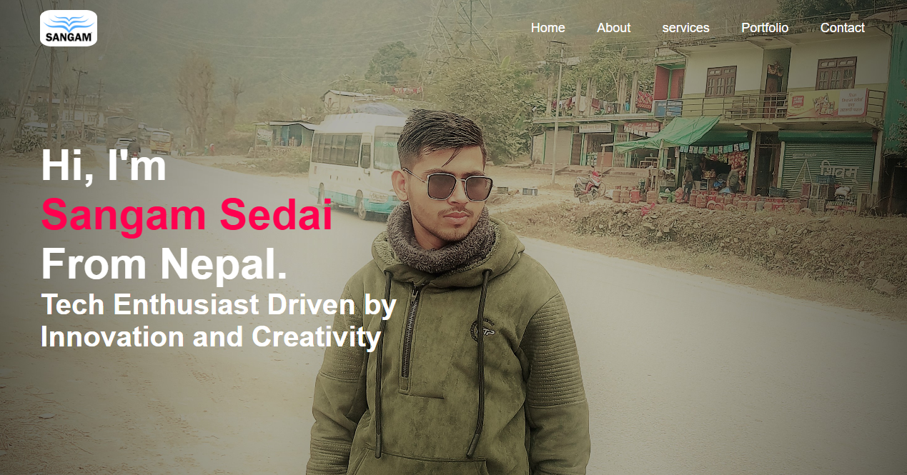

Here is  some information regarding my portfolio. 

            " Take a look !"

Project Title: Personal Portfolio Website
Developer: Sangam Sedai
Email: ssedai836@gmail.com
GitHub: https://github.com/sangam-star
LinkedIn: https://www.linkedin.com/in/sangam-sedai/

📌 OVERVIEW:
------------
This is a fully responsive personal portfolio website built using HTML, CSS, and JavaScript. 
It showcases personal information, skills, experiences, education, and past projects, 
and includes a contact form powered by Google Apps Script to send form data to Google Sheets.

📂 PROJECT STRUCTURE:
---------------------
- index.html      → Main webpage
- style.css       → CSS for layout and responsiveness
- imagee/         → Folder containing profile and logo images
- CV.pdf          → Downloadable resume file
- Font Awesome    → Used for icons (via CDN)

🧩 FEATURES:
-----------
1. **Navigation Bar** - Responsive with hamburger menu on smaller screens.
2. **Hero Section** - Catchy intro text and name.
3. **About Section** - Personal intro with tabbed info: Skills, Experience, Education.
4. **Services Section** - Short descriptions of what I offer.
5. **Portfolio Section** - Showcases past projects with hover effects.
6. **Contact Section** - Includes contact info and a form integrated with Google Sheets.
7. **Google Apps Script** - Handles form submission without needing backend hosting.

📥 FORM SUBMISSION:
-------------------
The contact form uses this script URL:
(https://script.google.com/macros/s/AKfycbzAqo5CAHrp08hWyxCPlimVxcYLDOPoAd9M9lZtUyhninmjo4HhB2kApyFar3jl0tVfeQ/exec)

⚠️ NOTE: 
If you see a warning like “Google hasn’t verified this app,” 
it means the Google Apps Script is not yet verified by Google. 
You can still use it by clicking “Advanced” > “Go to project (unsafe)” if it's your own script.

🛠 HOW TO USE:
--------------
1. Clone or download the project files.
2. Open `index.html` in any web browser to view.
3. To edit contact form data submission:
   - Replace the scriptURL in the JS with your own Google Apps Script.
4. Replace images and texts to personalize.
5. Make sure to host `CV.pdf` and `logo.png` in the correct folders.

🎨 CUSTOMIZATION:
-----------------
- Update styles in `style.css` as needed.
- Replace icons using Font Awesome classes.
- Change project images and links inside the Portfolio section.
- Update social links and contact info.

✅ CREDITS:
-----------
- Font Awesome (for icons)
- Google Apps Script (for contact form)
- Images used are from free resources and search engines

🚀 FUTURE IMPROVEMENTS:
------------------------
- Add animations with AOS or ScrollReveal
- Integrate a backend for more form features
- Add blog or testimonials section
- Dark/light mode toggle

## 📸 Screenshot

Thank you for visiting my portfolio!
